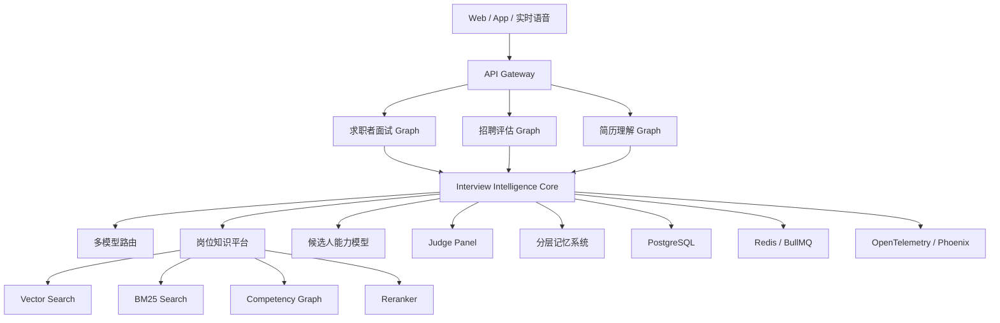
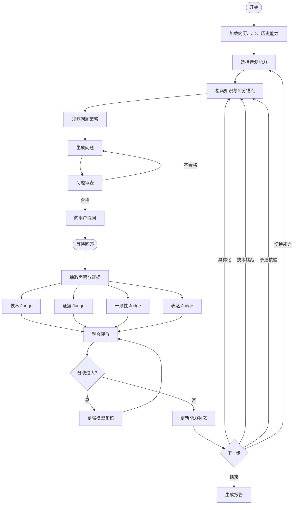
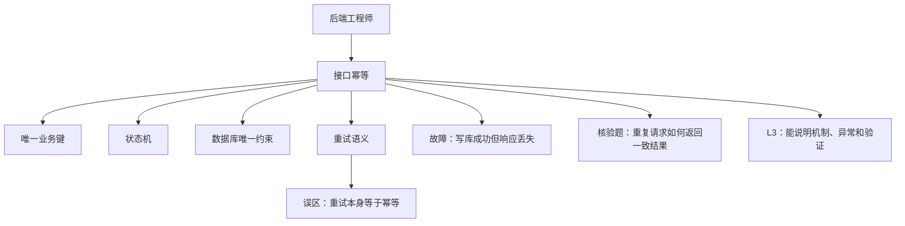
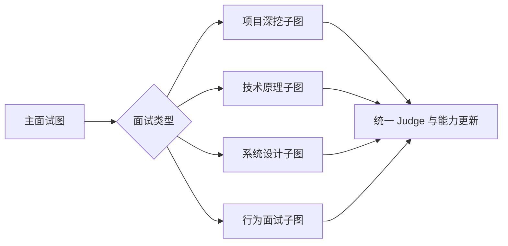
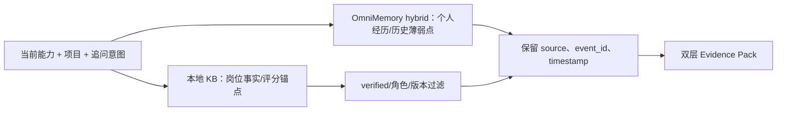

# OfferPilot 全产品 Agent 模型框架升级 PRD

> 文档版本：3.0  
> 文档状态：方案评审稿  
> 更新日期：2026-08-12  
> 产品定位：基于岗位知识、候选人证据和动态能力估计的 AI 压力面试训练与人才评估平台

> **架构修订声明（2026-08-12）**：本版本将 OmniMemory 定义为候选人个人/会话长期记忆层，将 `knowledge-base/` 定义为岗位权威知识层。当前阶段不部署 Milvus、MongoDB 或 Elasticsearch；不把 OmniMemory 当作事务数据库，也不把本地候选知识当作 verified Gold。语音面试仍不在本阶段范围内。本文中与此声明冲突的旧技术选型，以本声明和第 11、14、15 节为准。

## 目录

1. [执行摘要](#1-执行摘要)
2. [当前产品诊断](#2-当前产品诊断)
3. [产品目标](#3-产品目标)
4. [目标总体架构](#4-目标总体架构)
5. [四类 Graph 设计](#5-四类-graph-设计)
6. [Agent 角色与职责](#6-agent-角色与职责)
7. [压力面试模型](#7-压力面试模型)
8. [自适应选题模型](#8-自适应选题模型)
9. [本地知识库设计](#9-本地知识库设计)
10. [模型架构](#10-模型架构)
11. [记忆系统](#11-记忆系统)
12. [求职者产品流程](#12-求职者产品流程)
13. [招聘者产品流程](#13-招聘者产品流程)
14. [技术选型](#14-技术选型)
15. [版本迭代计划](#15-版本迭代计划)
16. [评测指标](#16-评测指标)
17. [数据、安全与合规](#17-数据安全与合规)
18. [团队配置建议](#18-团队配置建议)
19. [风险与应对](#19-风险与应对)
20. [最终产品定义](#20-最终产品定义)

---

## 1. 执行摘要

当前 OfferPilot 已经具备简历解析、面试状态机、成长报告、招聘匹配、模型网关和长期记忆等产品骨架，但智能能力仍主要来自：

```text
简历上下文
+ 固定 Prompt
+ 单次模型生成
+ 少量确定性规则
```

它目前更接近“带状态的 LLM 应用”，还不是成熟的面试智能系统。

升级目标不是简单引入 LangGraph，也不是堆叠多个自由聊天的 Agent，而是建立四个相互配合的核心系统：

1. **Agent 执行图**：控制提问、检索、核验、评分和转场。
2. **岗位能力知识图**：告诉系统岗位需要什么，以及技术上什么是正确的。
3. **候选人能力状态图**：持续估计用户掌握了什么、哪里仍不确定。
4. **评测与学习图**：记录每个决策为何发生，并用真实数据持续优化。

最终核心循环应从：

```text
用户回答
→ 模型评价
→ 模型生成下一题
```

升级为：

```text
用户回答
→ 证据抽取
→ 知识检索
→ 技术核验
→ 多维评价
→ 更新能力状态
→ 计算下一题信息价值
→ 选择压力策略
→ 生成并审查下一题
```

### 1.1 推荐技术路线

- Agent 编排：当前使用自研声明式 Graph Runtime；后续可在不改变 State/Node/Edge 契约的前提下替换为 LangGraph.js
- 模型抽象与流式输出：Vercel AI SDK
- 知识处理：LlamaIndex.TS + 自研领域索引管线
- 个人长期记忆：OmniMemory 托管 API（hybrid retrieval）
- 权威岗位知识：本地 JSONL/SQLite 知识服务，verified 状态门禁
- 主数据库：当前 SQLite；生产多租户阶段迁移 PostgreSQL
- 向量检索：当前不单独部署；仅在本地 KB 规模和离线评测证明必要时引入 pgvector
- 关键词检索：当前本地词法/关系检索；规模化后评估 SQLite FTS/OpenSearch
- 异步任务：当前 SQLite outbox；生产阶段按需引入 Redis + BullMQ
- 可观测性：OpenTelemetry + Phoenix
- 离线 Prompt/模型优化：DSPy Python Sidecar
- 文件存储：OSS/S3 私有对象存储
- 语音阶段：独立 STT/TTS/实时音频服务

---

## 2. 当前产品诊断

### 2.1 已具备且应该保留的能力

当前产品已经存在以下有价值的工程基础，不应全部推倒重建：

- 简历本地解析和原文件真实类型验证；
- 模型引文必须能在简历原文中定位；
- 版本化 Prompt；
- Zod 结构化输出；
- 模型失败后的确定性降级；
- 面试会话持久化；
- 回答能力与下一题能力归因分离；
- 问题重复检测；
- SQLite Memory Outbox；
- 模型运行审计；
- 幂等接口设计；
- 招聘评分的确定性权重。

主要实现位于：

- `src/model-gateway.ts`
- `src/resume-workflow.ts`
- `src/agent-runtime.ts`
- `src/agent-graph.ts`
- `src/database.ts`

### 2.2 当前主要问题

#### 2.2.1 Agent 编排过于简单

当前实际流程基本是：

```text
create opening
→ evaluate answer
→ guard
→ record state
→ generate next question
```

它缺少：

- 显式 Node 与 Edge；
- 多类型条件分支；
- 并行评价；
- 技术核验分支；
- 评分分歧处理；
- 知识不足处理；
- 人工复核节点；
- 节点级 checkpoint；
- 子图、回放和故障恢复能力。

#### 2.2.2 没有岗位知识系统

当前 Rubric 主要来自少量岗位预设和简历技术词。系统并不知道：

- 某个技术概念的正确原理；
- 常见误区；
- 不同级别应掌握到什么深度；
- 哪些追问能区分“背过答案”和“真正做过”；
- 某个技术方案的合理边界；
- 某个指标应如何验证。

因此模型只能依靠预训练知识和 Prompt 临场发挥。

#### 2.2.3 缺少真正的候选人能力模型

当前系统主要记录：

- 每轮分数；
- 每个技能问过几次；
- 缺失证据；
- 能力覆盖率。

但缺少：

- 能力估计；
- 估计不确定度；
- 难度覆盖；
- 误区记录；
- 支持证据与反对证据；
- 多场训练趋势；
- 下一题预期信息增益。

#### 2.2.4 评分体系不足

当前评分较依赖语言特征和关键词，例如：

- 是否有数字；
- 是否出现“我负责”；
- 是否提到权衡；
- 回答长度。

这些特征有价值，但无法可靠判断：

- 技术是否正确；
- 指标是否可信；
- 方案是否真正可行；
- 回答是否与简历及前文冲突；
- 用户是在背模板还是真正理解。

#### 2.2.5 缺少数据闭环

当前 Silver 测试只能验证规则没有明显回归，不能证明：

- 题目是否像真实面试官；
- 评分是否与专家一致；
- 用户训练后是否真正提升；
- 压力等级是否合理；
- 对不同岗位和群体是否公平。

---

## 3. 产品目标

### 3.1 产品愿景

OfferPilot 要成为：

> 能理解岗位、理解简历、核验技术、动态追问并长期建模候选人能力的 AI 面试训练基础设施。

### 3.2 核心用户

#### 求职者

- 应届生；
- 1–5 年技术从业者；
- 转岗用户；
- 准备大厂技术面的人；
- 希望训练项目表达、系统设计、技术原理和行为面的人。

#### 招聘者

- 需要快速构建岗位 Rubric；
- 需要结构化阅读大量简历；
- 需要获得候选人核验问题；
- 需要统一面试评价标准；
- 需要保留人工最终决策。

### 3.3 核心用户价值

求职者不再只获得通用问题和模板化报告，而是获得：

- 结合真实 JD、简历和岗位知识的专属面试；
- 能沿回答内容连续追问的面试官；
- 能核验技术原理与项目真实性的压力面；
- 能识别“会背答案”和“真正掌握”的证据链；
- 跨多场训练持续更新的能力模型；
- 精确到技能、误区和证据缺口的训练路径。

### 3.4 非目标

第一阶段不应：

- 自动替企业拒绝候选人；
- 根据表情、性别、口音推断人格或能力；
- 把说话速度直接当成技术能力；
- 声称评分等同于真实招聘结论；
- 让 Agent 自由访问互联网并把非权威内容作为评分标准；
- 在缺少校准数据时声称分数具有心理测量学效度。

---

## 4. 目标总体架构



### 4.1 架构原则

1. **确定性优先**：流程、权限、聚合和终止条件由代码控制。
2. **模型职责隔离**：提问、核验、评价、反馈不由一个模型一次完成。
3. **知识可追溯**：强技术结论必须附知识来源。
4. **状态显式化**：每轮能力变化必须有原因和证据。
5. **失败可恢复**：任意节点失败后可从 checkpoint 恢复。
6. **结果可回放**：可用新模型或新 Prompt 重跑历史节点。
7. **评测先行**：任何 Agent 升级必须在冻结数据集上比较。

---

## 5. 四类 Graph 设计

### 5.1 Agent 执行图

Agent 执行图负责回答“系统下一步应该执行什么”。



该图应由当前声明式 Graph Runtime 实现，并保持可替换为 LangGraph.js 的 State/Node/Edge 契约，具备：

- 显式 State；
- 普通 Edge；
- 条件 Edge；
- 循环；
- 并行 Judge；
- 用户回答中断；
- checkpoint；
- time travel；
- 子图；
- 人工复核中断。

### 5.2 岗位能力知识图

岗位能力知识图负责回答：

- 这个岗位需要什么？
- 这项能力由哪些知识和行为组成？
- 不同级别应掌握到什么程度？
- 应通过什么问题验证？



### 5.3 候选人能力状态图

候选人能力状态图负责回答：

- 对用户的哪些能力已有把握？
- 哪些能力仍不确定？
- 哪些判断有证据？
- 哪些地方存在误区或矛盾？

```ts
type SkillBelief = {
  skillId: string;
  estimatedLevel: number;
  uncertainty: number;
  evidenceCount: number;
  maxDifficultyPassed: number;
  misconceptions: string[];
  supportingEvidenceIds: string[];
  contradictingEvidenceIds: string[];
  lastTestedAt: string;
};
```

### 5.4 评测与学习图

评测与学习图记录：

- 这道题为什么被选择；
- 检索了哪些知识；
- 每个 Judge 做出了什么判断；
- 最终分数如何聚合；
- 能力状态为什么变化；
- 下一题为什么继续或切换。

该图支持：

- 历史回放；
- 更换模型重跑；
- Prompt 对比；
- 检索策略对比；
- 坏问题定位；
- 人工纠正；
- 训练数据构建。

### 5.5 面试类型子图

不同面试模式不能只改变 Prompt 文案，应体现为不同子图。



#### 项目深挖子图

```text
职责边界
→ 请求链路
→ 关键机制
→ 选型权衡
→ 指标验证
→ 故障边界
```

#### 技术原理子图

```text
概念定义
→ 内部机制
→ 复杂度/性能
→ 适用条件
→ 不适用边界
→ 与替代方案比较
```

#### 系统设计子图

```text
需求澄清
→ 容量估算
→ 核心组件
→ 数据模型
→ 一致性
→ 故障恢复
→ 可观测性
→ 演进方案
```

#### 行为面试子图

```text
情境
→ 个人任务
→ 实际行动
→ 决策依据
→ 结果
→ 反思
→ 迁移到新场景
```

---

## 6. Agent 角色与职责

### 6.1 Resume Intelligence Agent

负责：

- 文档解析；
- 经历分段；
- 技能抽取；
- 个人贡献识别；
- 成果和指标识别；
- 原文证据定位；
- 声明可信度分类；
- 简历能力图构建。

核心输出：

```ts
type CandidateClaim = {
  claimId: string;
  experienceId: string;
  skillIds: string[];
  claim: string;
  evidenceSpans: Citation[];
  status:
    | "proven_in_resume"
    | "candidate_claimed"
    | "contradicted"
    | "unknown";
  verificationPriority: number;
};
```

该 Agent 不负责给候选人打面试分，只负责建立事实和主张基线。

### 6.2 Job Intelligence Agent

负责：

- 解析 JD；
- 识别岗位、级别和职责；
- 连接岗位知识图；
- 生成能力权重；
- 生成深度要求；
- 输出评分锚点；
- 输出必问能力和禁问范围。

招聘场景下，Rubric 必须经过人工确认并固化版本。

### 6.3 Interview Director

Interview Director 是决策中枢，只负责制定计划，不直接生成面试话术。

```ts
type QuestionPlan = {
  targetSkillId: string;
  objective:
    | "establish_baseline"
    | "verify_ownership"
    | "verify_mechanism"
    | "test_tradeoff"
    | "test_metric"
    | "test_failure"
    | "resolve_contradiction";
  difficulty: 1 | 2 | 3 | 4 | 5;
  pressureStrategy: string;
  requiredEvidence: string[];
  retrievalQuery: string;
  reason: string;
};
```

### 6.4 Knowledge Retrieval Agent

负责：

- Query Rewrite；
- BM25 检索；
- Vector Search；
- 能力图邻居检索；
- Metadata Filter；
- RRF 融合；
- Cross-Encoder Rerank；
- Citation Pack 构建。

### 6.5 Question Composer

将结构化计划转换成自然、专业、单一主问题，但无权改变：

- 目标能力；
- 问题难度；
- 证据期待；
- 压力策略；
- 岗位范围。

### 6.6 Question Guard

检查：

- 是否超出岗位范围；
- 是否包含简历不存在的事实；
- 是否与历史问题重复；
- 是否同时询问多个主问题；
- 是否存在诱导性；
- 是否具有歧视性；
- 是否依赖知识库未覆盖的强结论；
- 是否符合压力等级；
- 是否存在不专业或伤害性表达。

### 6.7 Evidence Extractor

从回答中抽取：

- 个人职责；
- 输入输出；
- 技术动作；
- 因果关系；
- 替代方案；
- 指标；
- 样本与基线；
- 验证方法；
- 异常处理；
- 不确定表达；
- 与前文可能冲突的内容。

### 6.8 Technical Verifier

将回答中的技术声明与知识库比较：

```ts
type ClaimVerification = {
  claim: string;
  verdict:
    | "supported"
    | "partially_supported"
    | "incorrect"
    | "context_dependent"
    | "not_verifiable";
  citations: string[];
  misconception?: string;
  confidence: number;
};
```

### 6.9 Judge Panel

| Judge | 评价对象 |
| --- | --- |
| Technical Judge | 技术正确性、深度和边界 |
| Evidence Judge | 职责、机制、指标和验证证据 |
| Consistency Judge | 简历与前后回答一致性 |
| Communication Judge | 切题、清晰和结构化表达 |

聚合器由代码控制，不允许任一模型直接生成最终总分。

Judge 分歧过大时，系统输出 `low_confidence` 并进入更强模型复核或人工复核。

### 6.10 Ability State Updater

根据以下数据更新候选人能力状态：

- 问题难度；
- Judge 结果；
- 证据质量；
- 评价置信度；
- 历史表现；
- 是否出现技术误区；
- 是否通过反例和故障场景。

### 6.11 Session Critic

审查系统本轮自身表现：

- 上一题是否有效；
- 是否获得新增信息；
- 是否重复；
- 是否偏离岗位；
- 压力是否过度或不足；
- 是否误用了知识库；
- 是否应切换策略。

### 6.12 Career Coach Agent

负责把技术判断转换成训练建议：

- 为什么失分；
- 应学习什么；
- 应重讲哪个项目；
- 应补什么证据；
- 应完成什么练习；
- 如何验证已经改进；
- 何时复测以及使用什么难度。

---

## 7. 压力面试模型

### 7.1 压力的产品定义

压力不等于语言攻击，而是提高验证密度、思考难度和交叉核验强度。

主要策略：

1. **具体化压力**：要求真实输入、输出和执行链路。
2. **所有权压力**：区分个人贡献、团队贡献和已有系统。
3. **反事实压力**：不使用当前方案时会发生什么。
4. **故障压力**：依赖超时、重复请求、部分失败。
5. **规模压力**：流量、数据、并发扩大后的变化。
6. **指标压力**：追问样本、基线、口径和波动。
7. **一致性压力**：与简历及前文交叉核验。
8. **时间压力**：要求在有限时间内组织清晰回答。

### 7.2 压力等级

| 等级 | 面试行为 |
| --- | --- |
| L1 | 引导式，允许补充背景和解释术语 |
| L2 | 要求个人职责和一个实现细节 |
| L3 | 连续核验机制、权衡和指标 |
| L4 | 增加故障、规模变化和反例 |
| L5 | 高密度交叉核验、矛盾检查和时间约束 |

所有等级都禁止：

- 嘲讽；
- 羞辱；
- 人格判断；
- 与岗位无关的压迫；
- 通过敏感属性制造压力。

---

## 8. 自适应选题模型

### 8.1 选题目标函数

```text
QuestionUtility =
预期信息增益
× 岗位重要度
× 当前不确定度
× 简历相关性
× 可核验性
× 难度匹配度
- 重复惩罚
- 用户疲劳成本
- 越界风险
- 知识不足风险
```

### 8.2 冷启动阶段

在缺少真实题目参数时：

- 题目难度由专家和规则标注；
- 能力使用 Beta/Normal 等概率近似；
- 每次回答更新能力均值和不确定度；
- 同一能力多次相似回答主要降低不确定度；
- 更高难度的正确回答显著提高估计；
- 离题回答只代表本轮缺少有效信息，不直接证明能力低；
- 技术错误与证据不足必须分别建模。

### 8.3 数据成熟阶段

逐步引入：

- 多维 IRT；
- Bayesian Knowledge Tracing；
- Contextual Bandit；
- 问题难度自动标定；
- 问题区分度预测；
- 选题策略离线强化学习。

在缺少大规模专家数据时，不直接上线强化学习选题。

---

## 9. 本地知识库设计

### 9.1 知识库定位

知识库不是简单的 PDF 文件夹，而是结构化岗位知识平台，至少包含：

本地知识库是岗位的权威事实层，不承载候选人的长期个人记忆。候选人历史经历、已验证薄弱点和跨场训练上下文由 OmniMemory 保存与召回；两者在 Agent 层通过 Evidence Pack 融合，但必须保留来源和状态，不能混成一个事实集合。

```text
岗位能力库
技术原理库
项目核验库
面试题型库
评分锚点库
学习资源库
```

### 9.2 核心实体

```text
Role
Company
Seniority
Competency
Skill
Concept
Prerequisite
QuestionArchetype
FollowupStrategy
Misconception
FailureMode
Metric
ScoringAnchor
Source
```

### 9.3 首批知识域

MVP 先建设三个垂直方向：

- Java/Go 后端工程师；
- AI/RAG/LLM 应用工程师；
- 前端工程师。

每个方向至少建设：

- 30 个核心能力；
- 150 个技术概念；
- 300 个问题原型；
- 600 条追问策略；
- 200 个常见误区；
- 100 个故障场景；
- 每项能力 4–5 级评分锚点。

### 9.4 知识来源

优先级：

1. 官方技术文档；
2. 权威教材和公开课程；
3. 开源项目官方设计文档；
4. 专家原创内容；
5. 经授权和脱敏的真实面试案例；
6. 公开 JD 的统计分析结果。

禁止直接批量抓取受版权保护的付费面经作为商业知识资产。

### 9.5 检索流程



当前阶段不要求本地 KB 立即拥有独立向量库。只有当离线评测证明词法+关系召回不足时，才引入 pgvector 或 OpenSearch；Milvus、MongoDB 不属于默认依赖。

### 9.6 Evidence Pack

```ts
type KnowledgeEvidencePack = {
  conceptFacts: CitationFact[];
  misconceptions: CitationFact[];
  tradeoffs: CitationFact[];
  failureModes: CitationFact[];
  scoringAnchors: ScoringAnchor[];
  retrievalConfidence: number;
  personalMemory: Array<{ eventId: string; source: "memory" | "pending_message"; text: string; timestamp?: string }>;
  provenance: { localEntityIds: string[]; memoryEventIds: string[]; generatedAt: string };
};
```

---

## 10. 模型架构

### 10.1 在线模型分层

| 模型层 | 任务 | 主要要求 |
| --- | --- | --- |
| Router Model | 意图、技能和题型路由 | 快、便宜、稳定 |
| Extractor Model | 简历和回答证据抽取 | 结构化输出能力强 |
| Interview Model | 问题生成和自然对话 | 中文自然、指令遵循强 |
| Reasoning Model | 技术核验和冲突分析 | 推理与长上下文能力强 |
| Judge Model A | Rubric 与证据评分 | 与出题模型隔离 |
| Judge Model B | 技术正确性复核 | 优先使用不同模型族 |
| Embedding Model | 中英文技术知识向量 | 技术检索效果稳定 |
| Reranker | 多路召回重排 | 中英文 Cross-Encoder |
| STT/TTS | 后续语音面试 | 低延迟、可流式 |

### 10.2 模型隔离原则

- 出题模型不能单独为自己出的题评分；
- Judge 看不到其他 Judge 的结论；
- 招聘排序隐藏姓名、性别、照片等无关属性；
- Judge 输入尽量移除答案长度和格式噪声；
- 分数聚合由代码完成；
- 技术强结论必须有 Citation；
- 关键结论必须包含置信度；
- 模型、Prompt、参数版本必须可回放。

### 10.3 最终评分示意

```text
能力得分 =
技术正确性 × 岗位权重
+ 证据完整度
+ 项目所有权
+ 验证成熟度
+ 表达质量
- 冲突惩罚
- 无依据确定性表达惩罚
```

评分必须按能力分别计算，再聚合成整场结果。不得用单个模型直接输出不可解释的总分。

### 10.4 是否训练自有模型

短期不训练基础大模型，优先建设四类可学习模型：

1. 技能和证据分类器；
2. 问题难度预测器；
3. 回答质量与评分校准器；
4. 下一题策略模型。

演进路线：

```text
Prompt + RAG
→ 专家 Few-shot
→ DSPy Prompt 优化
→ 小模型证据抽取 SFT/LoRA
→ Judge/校准模型
→ 问题难度模型
→ Contextual Bandit 或离线 RL 选题
```

---

## 11. 记忆系统

### 11.1 工作记忆

单场面试内保存：

- 最近对话；
- 当前项目；
- 当前能力；
- 已覆盖证据；
- 当前问题策略；
- 最新检索结果；
- 未完成节点和 checkpoint。

### 11.2 情景记忆

保存具体面试事件：

- 问过什么；
- 用户如何回答；
- 哪些地方失分；
- 哪些地方产生矛盾；
- 哪些追问有效；
- 哪些知识被使用。

### 11.3 语义记忆

跨场训练保存：

- 稳定薄弱点；
- 常见误区；
- 已证明能力；
- 已掌握难度；
- 训练完成情况；
- 推荐复测时间。

候选人级语义记忆优先写入 OmniMemory。写入必须经过 PII 脱敏、owner/device 隔离和异步 job 状态确认；`source=memory` 才能作为历史证据，`source=pending_message` 只能作为待验证线索。

### 11.4 双层 RAG 边界

```text
当前问题
  ├── OmniMemory hybrid retrieval：候选人个人历史记忆
  └── Local KB retrieval：岗位权威事实、误区、故障、评分锚点
          ↓
Evidence Pack（分别保留来源、状态、时间和置信度）
          ↓
Judge / Ability Updater
```

OmniMemory 不替代 OfferPilot 的 checkpoint、审计、幂等、知识审核和事务数据。

### 11.5 产品记忆

系统级聚合：

- 哪类问题最有效；
- 哪些 Prompt 容易生成重复问题；
- 哪些 Judge 经常与专家不一致；
- 哪类知识检索经常失败；
- 哪些训练任务能带来复测提升。

用户记忆与产品优化数据必须严格隔离、授权和脱敏。

---

## 12. 求职者产品流程

### 12.1 入门

```text
上传简历
→ 选择目标岗位或输入 JD
→ 生成候选人证据图
→ 生成岗位能力图
→ 展示训练重点
```

### 12.2 面试前

用户选择：

- 面试类型；
- 公司或面试风格；
- 压力等级；
- 面试时长；
- 文本或语音；
- 是否允许即时反馈；
- 是否重点训练特定技能。

### 12.3 面试中

前端展示：

- 当前问题；
- 剩余时间；
- 面试进度；
- 可选语音转写；
- 暂不实时展示每轮分数，避免干扰表现。

后台执行：

- 知识检索；
- 证据抽取；
- 技术核验；
- 多 Judge；
- 能力状态更新；
- 下一题规划；
- Trace 和 checkpoint。

### 12.4 面试后

报告包括：

- 综合结果；
- 能力状态；
- 简历声称与面试证明对照；
- 技术误区；
- 高质量回答证据；
- 矛盾与待核验项；
- 7 天和 30 天训练计划；
- 复测题；
- 推荐下一次压力等级。

---

## 13. 招聘者产品流程

### 13.1 JD 建模

```text
上传 JD
→ 连接岗位知识库
→ 生成 Rubric
→ 招聘者确认
→ 固化 Rubric 版本
```

### 13.2 简历分析

```text
逐份解析
→ 独立证据抽取
→ 对照 Rubric
→ 生成待核验问题
→ 输出可解释结果
```

### 13.3 排名

必须分离：

- 确定性基础分；
- 模型语义发现；
- 横向校准分；
- 最终排序；
- 人工调整；
- 人工调整原因。

当前版本虽然生成 `calibrationDelta`，但没有真正应用，应在升级中明确选择：

- 仅使用模型补充解释，不改变排序；或
- 在严格限制范围内应用校准分并重新排序。

### 13.4 招聘风险控制

- 隐藏姓名、照片、性别等无关信息；
- 禁止将模型结果作为自动拒绝的唯一依据；
- 保存人工复核记录；
- 提供候选人数据删除和导出；
- 监控不同群体的评分差异；
- 不用表情、口音和非岗位相关特征推断人格。

---

## 14. 技术选型

### 14.1 推荐技术栈

| 层 | 推荐方案 |
| --- | --- |
| 前端 | React/Next.js + Vercel AI SDK UI |
| API | 保留 Fastify，逐步模块化 |
| Agent Runtime | 自研声明式 Graph Runtime（LangGraph.js 可选替换） |
| Schema | Zod |
| 个人长期记忆 | OmniMemory 托管 API |
| 权威岗位知识 | 本地 JSONL/SQLite 知识服务 |
| 主数据库 | 当前 SQLite，生产迁移 PostgreSQL |
| 向量检索 | 当前不部署；按评测结果评估 pgvector |
| 关键词检索 | 当前本地检索；规模化后评估 FTS/OpenSearch |
| 缓存与队列 | 当前 SQLite outbox；生产按需 Redis + BullMQ |
| 文件存储 | OSS/S3 私有桶 |
| 模型路由 | 自研 Model Gateway + 多供应商适配 |
| Trace | OpenTelemetry |
| LLM 可观测性 | Phoenix |
| 离线优化 | DSPy Python Sidecar |

### 14.2 为什么选择 LangGraph.js

Graph Runtime（未来可由 LangGraph.js 承载）负责：

- 显式 State；
- Node 与条件 Edge；
- 循环；
- 并行 Judge；
- 等待用户回答；
- checkpoint；
- 失败恢复；
- time travel；
- 子图；
- 人工中断。

Graph Runtime 不负责：

- 自动生成知识库；
- 自动设计能力模型；
- 自动提高问题质量；
- 自动训练模型；
- 自动保证评分公平。

### 14.3 Graph State 建议

```ts
type InterviewGraphState = {
  session: SessionConfig;
  candidate: CandidateProfile;
  roleRubric: RoleCompetencyGraph;

  transcript: Turn[];
  currentThread: InterviewThread;
  skillBeliefs: Record<string, SkillBelief>;
  evidenceLedger: EvidenceLedgerItem[];
  contradictions: Contradiction[];

  retrievalPack?: KnowledgeEvidencePack;
  questionPlan?: QuestionPlan;
  pendingQuestion?: InterviewQuestion;
  latestAnswer?: string;
  latestEvidence?: ExtractedEvidence;
  judgeResults?: JudgeResult[];

  pressureState: PressureState;
  fatigueState: FatigueState;
  budget: InterviewBudget;

  trace: AgentTraceMetadata;
  nextAction:
    | "retrieve"
    | "ask"
    | "clarify"
    | "challenge"
    | "change_skill"
    | "finish"
    | "human_review";
};
```

每个节点只能更新被授权字段，模型不能一次输出并覆盖整个 State。

---

## 15. 版本迭代计划

### Phase 0：建立真实基线

周期：2–3 周。

交付：

- 收集当前系统 100–200 条面试轨迹；
- 专家标注问题质量和回答评分；
- 建立当前版本基准；
- 明确前三个岗位方向；
- 固化评测和业务数据 Schema。

验收：

- 有可重复运行的 Gold/Silver 基线；
- 所有后续改动都能与当前系统比较。

### Phase 1：Graph Runtime

周期：4–6 周。

交付：

- Graph Runtime 与 checkpoint；
- 面试共享 State；
- Interview Director；
- Question Composer；
- Evidence Extractor；
- Question Guard；
- checkpoint；
- V1 API 全量幂等；
- 节点级 Trace。

验收：

- 面试可在任意用户等待点恢复；
- 每轮决策可回放；
- 重复问题率比当前版本下降 50%；
- 项目连续追问质量显著提高。

### Phase 2：OmniMemory 双层 RAG

周期：6–8 周。

交付：

- OmniMemory hybrid retrieval 接入；
- 本地权威 KB 的 verified 门禁与来源追踪；
- 双路 Evidence Pack 和 provenance；
- 只有离线评测不达标时才增加 pgvector/FTS/Reranker；
- AI/RAG、后端、前端知识域；
- Citation；
- Technical Verifier；
- 知识运营后台。

验收：

- 至少 95% 技术强结论有引用；
- 不支持的技术断言率低于 2%；
- Personal memory 命中、来源完整、跨用户隔离和 Recall@10 达到冻结测试集门槛。

### Phase 3：Judge Panel 与能力模型

周期：6–8 周。

交付：

- 四类 Judge；
- 分歧复核；
- Skill Belief；
- 自适应选题；
- 多场能力趋势；
- 评分校准。

验收：

- Judge 与专家相关性达到 0.75；
- 下一题专家有效率达到 80%；
- 能力估计随有效证据稳定收敛。

### Phase 4：语音压力面

周期：6–10 周。

交付：

- 流式 STT；
- 流式 TTS；
- 停顿和超时控制；
- 实时字幕；
- 低延迟追问；
- 语音和文本统一 State。

验收：

- P95 首字响应符合交互目标；
- 转写错误不直接进入强评分；
- 用户可以查看并修正转写。

### Phase 5：学习与模型训练闭环

周期：持续进行。

交付：

- 专家标注平台；
- DSPy Prompt 优化；
- 小模型证据抽取；
- Judge 校准模型；
- 问题难度模型；
- Contextual Bandit 选题实验。

---

## 16. 评测指标

### 16.1 单轮指标

- Question relevance；
- Question novelty；
- Resume grounding；
- Knowledge grounding；
- Follow-up continuity；
- Evidence extraction F1；
- Technical correctness；
- Judge-human correlation；
- Score calibration error；
- Schema-valid rate；
- P95 latency；
- 单轮 token 与成本。

### 16.2 整场指标

- 必考能力覆盖率；
- 每轮新增信息量；
- 重复题率；
- 项目连续深挖率；
- 能力估计收敛速度；
- 报告事实一致性；
- 用户感知真实度；
- 用户训练收益；
- 人工专家一致率。

### 16.3 Gold 数据集

至少建设：

- 300 份脱敏简历；
- 100 个真实 JD；
- 1,000 道专家标注问题；
- 3,000 个回答片段；
- 500 条连续追问轨迹；
- 每条至少双人标注和仲裁；
- 技术正确性、证据完整度和问题价值分别标注。

### 16.4 MVP 发布门槛

| 指标 | 目标 |
| --- | ---: |
| 岗位相关问题率 | ≥ 95% |
| 引用可定位率 | ≥ 98% |
| 严重技术误判率 | ≤ 2% |
| 连续问题重复率 | ≤ 3% |
| 专家认可追问有效率 | ≥ 80% |
| Judge/专家相关性 | ≥ 0.75 |
| 报告无支持结论率 | ≤ 1% |
| 跨租户检索泄漏 | 0 |
| 文本单轮 P95 | ≤ 6 秒 |

---

## 17. 数据、安全与合规

### 17.1 数据分级

- L0：公开岗位知识；
- L1：脱敏产品统计；
- L2：用户简历和面试文本；
- L3：联系方式、身份信息和企业候选人资料；
- L4：密钥、认证信息和内部管理数据。

### 17.2 必须实现

- 真实认证；
- RBAC；
- 组织和用户多租户隔离；
- 对象存储私有桶；
- 服务端加密；
- HMAC 化外部设备标识；
- 数据保存期限；
- 删除和导出；
- 模型供应商数据使用配置；
- 审计日志；
- 知识库来源和版权记录；
- 招聘结果人工复核。

### 17.3 明确禁止

- 以模型结果作为自动拒绝候选人的唯一依据；
- 使用与岗位无关的敏感属性参与评分；
- 用声音、面部或口音推断受保护人格特征；
- 将用户原始简历直接作为产品级训练数据而不经授权；
- 在不同租户之间共享候选人记忆。

---

## 18. 团队配置建议

MVP 最低团队：

- 1 名产品负责人；
- 1 名 Agent/LLM 架构工程师；
- 2 名后端工程师；
- 1 名前端工程师；
- 1 名数据/RAG 工程师；
- 1 名算法/评测工程师；
- 3–5 名兼职岗位专家；
- 1 名安全与隐私顾问。

最稀缺的资源不是普通开发，而是：

- 岗位知识运营；
- 专家评分标准；
- 高质量面试轨迹；
- 持续评测体系。

---

## 19. 风险与应对

| 风险 | 表现 | 应对措施 |
| --- | --- | --- |
| 过度工程化 | Agent 数量多但效果没有提升 | 每个节点必须有独立指标和消融实验 |
| 知识库质量差 | 检索到错误或过时资料 | 来源分级、版本、有效期和专家审核 |
| Judge 偏差 | 偏好长答案或特定表达 | 多 Judge、格式归一、人工标定和校准 |
| 延迟过高 | 每轮多模型调用导致体验变差 | 并行 Judge、小模型路由、缓存和预算控制 |
| 成本过高 | Reasoning 模型使用过多 | 置信度路由，仅困难样本升级模型 |
| 能力模型伪精确 | 小样本却输出高精度分数 | 展示区间和置信度，不只展示单点分数 |
| 问题重复 | 多轮追问语义趋同 | 历史语义检索、问题目标去重和信息增益指标 |
| Prompt 注入 | 用户回答试图改变评分规则 | 用户内容作为不可信数据、节点权限和 Schema 隔离 |
| 招聘合规风险 | 模型结论被用于自动淘汰 | 强制人工复核和完整审计 |
| 数据泄漏 | 简历或记忆跨用户出现 | 多租户过滤、HMAC 标识和零泄漏发布门槛 |

---

## 20. 最终产品定义

OfferPilot 3.0 不应定义为“一个会问问题的 AI 面试官”，而应定义为：

> 一个以岗位权威知识和 OmniMemory 个人记忆为双层事实基础，以候选人能力状态为用户模型，以声明式 Graph Runtime 为执行引擎，以多 Judge 和证据账本为评估机制，并能通过真实训练数据持续进化的面试智能系统。

未来技术与商业壁垒由以下部分共同组成：

```text
岗位知识库
+ 能力图谱
+ 候选人证据图
+ 自适应选题模型
+ 技术核验系统
+ 多 Judge 校准
+ 真实面试 Gold 数据
+ 长期训练效果数据
```

Graph Runtime 是让这些组件可靠协同的运行骨架；真正决定产品效果和长期竞争力的，是双层记忆边界、知识、能力建模、评估标准和数据闭环。

最终核心决策循环为：

```text
当前对候选人的哪些能力仍不确定？
→ 哪个问题最能降低这种不确定性？
→ 回答提供了哪些可验证证据？
→ 技术上是否正确，是否与前文一致？
→ 能力估计应如何更新？
→ 下一步追问能否获得新的信息？
```

这套循环是 OfferPilot 从普通 LLM 面试应用升级为面试智能系统的核心。
