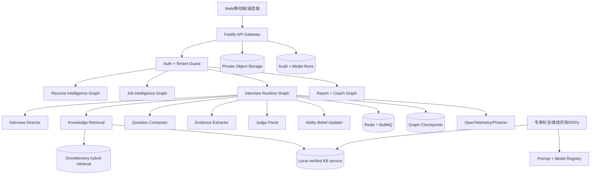

# OfferPilot 3.0 完整技术架构与模型实现方案

> 版本：1.0  
> 日期：2026-08-12  
> 依据：[OFFERPILOT_AGENT_3_PRD.md](./OFFERPILOT_AGENT_3_PRD.md)、[INTERVIEW_KNOWLEDGE_SOURCE_CATALOG.md](./INTERVIEW_KNOWLEDGE_SOURCE_CATALOG.md)、`knowledge-base/` 当前实现

> **架构修订声明（2026-08-12）**：采用 OmniMemory 作为候选人个人/会话长期记忆层，采用本地 `knowledge-base/` 作为岗位权威知识层。当前不部署 Milvus、MongoDB、Elasticsearch；SQLite 继续承担本地事务和 checkpoint，生产多租户阶段再迁移 PostgreSQL。语音链路不在本阶段范围内。本文旧版基础设施描述与本声明冲突时，以本声明和第 4、9 节为准。

## 0. 方案结论

OfferPilot 的核心不是“调用一个更强的模型”，而是把一次面试变成一个可恢复、可解释、可评测的决策系统：

```text
简历/JD
  → 证据图与岗位能力图
  → Interview Director 选择当前最有价值的核验目标
  → Knowledge Retrieval 组装技术事实和评分锚点
  → Question Composer 生成问题
  → Candidate Answer
  → Evidence Extractor 抽取声明、职责、指标和边界
  → Technical/Evidence/Consistency/Communication Judges 并行评价
  → Ability State 更新
  → 压力策略与下一题选择
  → 报告、训练计划和下一次复测
```

系统应采用“代码控制流程、模型完成语言与判断、知识库提供事实、专家数据校准分数”的边界。

当前项目已经有 `src/model-gateway.ts`、`src/agent-runtime.ts`、`src/agent-graph.ts`、`src/database.ts`、`src/omnimemory.ts`、Prompt Registry 和 PII 处理；新增/持续完善知识检索、能力状态、Judge Panel 和离线评测层。旧 `engine.ts`、`interview-planner.ts`、`growth.ts` 已删除。

## 1. 总体系统架构



### 1.1 运行边界

| 层 | 负责 | 不负责 |
|---|---|---|
| API 层 | 鉴权、租户隔离、幂等、SSE/流式响应 | 决定下一道题 |
| Graph Runtime | 状态转换、节点、条件边、恢复、人工中断 | 保存原始大文件 |
| Model Gateway | 模型路由、重试、结构化输出、成本审计 | 业务状态持久化 |
| Knowledge Service | 召回、重排、来源过滤、引用包 | 直接修改能力分数 |
| Judge Panel | 结构化评价和技术核验 | 直接决定总分 |
| Aggregator | 代码聚合分数和置信度 | 生成自然语言结论 |
| OmniMemory | 候选人个人/会话长期记忆、混合召回、时间和证据 | OfferPilot 事务状态与岗位权威知识 |
| SQLite（生产 PostgreSQL） | 事实、状态、版本、证据、审计、checkpoint | 个人长期记忆召回 |
| SQLite outbox（生产 Redis/BullMQ） | 异步任务、限流、短期缓存 | 长期事实存储 |

## 2. Agent Graph 具体设计

### 2.1 Graph State

```ts
export type InterviewGraphState = {
  session: {
    id: string;
    ownerId: string;
    mode: "candidate" | "recruiter";
    interviewType: "project_deep_dive" | "technical_fundamentals" | "system_design" | "behavioral";
    pressure: 1 | 2 | 3 | 4 | 5;
    questionBudget: number;
    timeBudgetSec: number;
    status: "running" | "waiting_answer" | "paused" | "finished" | "human_review";
  };
  candidate: CandidateEvidenceGraph;
  rubric: RoleRubricVersion;
  transcript: Turn[];
  abilityBeliefs: Record<string, SkillBelief>;
  evidenceLedger: EvidenceLedgerItem[];
  contradictions: Contradiction[];
  currentThread: ThreadState;
  retrieval?: EvidencePack;
  questionPlan?: QuestionPlan;
  pendingQuestion?: Question;
  latestAnswer?: Answer;
  latestClaims?: CandidateClaim[];
  latestJudges?: JudgeResult[];
  pressureState: PressureState;
  fatigueState: FatigueState;
  budget: ModelBudget;
  nextAction: NextAction;
  trace: TraceContext;
};
```

约束：每个 Node 只能返回自己负责的字段 patch；禁止把完整 State 交给模型再整体覆盖。模型输出先过 Zod，再经过业务守卫。

### 2.2 主图节点

```text
load_context
  → load_or_create_rubric
  → select_target_skill
  → retrieve_evidence_pack
  → plan_question
  → compose_question
  → question_guard
  → interrupt(wait_for_answer)
  → extract_claims
  → parallel_judge
  → aggregate_judges
  → update_evidence_ledger
  → update_ability_beliefs
  → update_pressure_state
  → session_critic
  → route_next_action
```

### 2.3 条件路由

```ts
function routeNextAction(state: InterviewGraphState): NextAction {
  if (state.session.status === "human_review") return "human_review";
  if (state.budget.questionsUsed >= state.session.questionBudget) return "finish";
  if (state.latestJudges?.some(x => x.confidence < 0.55)) return "rejudge";
  if (state.latestJudges?.some(x => x.technicalVerdict === "incorrect")) return "clarify_boundary";
  if (state.contradictions.some(x => x.severity === "high")) return "resolve_contradiction";
  if (state.currentThread.requiredEvidence.length > state.currentThread.coveredEvidence.length) return "followup";
  return "select_next_skill";
}
```

### 2.4 子图

不同面试类型使用不同子图，但共享 State、Evidence Ledger、Judge Panel 和能力更新：

| 子图 | 节点序列 |
|---|---|
| 项目深挖 | 职责边界 → 请求链路 → 机制 → 选型 → 指标 → 故障 |
| 技术原理 | 定义 → 内部机制 → 复杂度 → 边界 → 对比方案 |
| 系统设计 | 需求澄清 → 规模估算 → 架构 → 数据流 → 一致性 → 降级 |
| 行为面试 | 情境 → 行动 → 结果 → 复盘 → 证据核验 |

## 3. 完整模型框架

### 3.1 模型角色分层

| 角色 | 输入 | 输出 | 路由策略 |
|---|---|---|---|
| Router | 当前 State 摘要 | 岗位、能力、题型、风险 | 小模型，低延迟 |
| Resume Extractor | 简历文本/文件 | 经引用的经历、技能、数字 | 结构化模型 |
| JD Extractor | JD 文本 | 职责、能力、级别、权重 | 结构化模型 |
| Director | Belief、预算、Evidence Pack | QuestionPlan | 推理模型，不能写话术 |
| Composer | QuestionPlan | 一个自然问题 | 中文对话模型 |
| Extractor | 回答文本 | Claims、指标、职责、边界 | 结构化模型 |
| Technical Judge | Claims + 官方事实 | 技术 verdict、引用、置信度 | 独立模型族 |
| Evidence Judge | Claims + 简历 | 证据完整度、ownership | 独立模型族 |
| Consistency Judge | 全场 Transcript | 矛盾和时间线冲突 | 独立模型族 |
| Communication Judge | 回答 + Rubric | 切题、结构、表达 | 独立模型族 |
| Critic | 本轮 Trace | 重复、越界、信息增益 | 低频调用 |
| Coach | Judge + Belief | 学习建议、训练计划 | 报告阶段调用 |

### 3.2 模型路由抽象

现有 `src/model-gateway.ts` 扩展为统一接口：

```ts
export type ModelTask =
  | "route" | "extract_resume" | "extract_jd" | "plan_question"
  | "compose_question" | "extract_claims" | "technical_judge"
  | "evidence_judge" | "consistency_judge" | "communication_judge"
  | "critic" | "coach";

export type ModelRequest<T> = {
  task: ModelTask;
  promptVersion: string;
  input: unknown;
  schema: z.ZodType<T>;
  maxTokens: number;
  temperature: number;
  timeoutMs: number;
  traceId: string;
};

export interface ModelGateway {
  execute<T>(request: ModelRequest<T>): Promise<{
    data: T;
    model: string;
    latencyMs: number;
    usage: { inputTokens: number; outputTokens: number; costMicros?: number };
  }>;
}
```

路由规则：

```text
低风险/高频结构化抽取 → 小模型
正常出题/摘要 → 主对话模型
技术冲突/低置信度 → 推理模型
多 Judge → 至少两个模型族，防止同源偏差
```

### 3.3 Judge 聚合

每个 Judge 先输出单独结果，代码再做聚合：

```ts
type JudgeResult = {
  judge: "technical" | "evidence" | "consistency" | "communication";
  score: number;              // 0..10
  confidence: number;         // 0..1
  verdict: string;
  evidenceIds: string[];
  issues: string[];
};

function aggregate(results: JudgeResult[]) {
  const weights = { technical: .40, evidence: .25, consistency: .20, communication: .15 };
  const score = results.reduce((sum, x) => sum + x.score * weights[x.judge], 0);
  const confidence = results.reduce((sum, x) => sum + x.confidence, 0) / results.length;
  const spread = Math.max(...results.map(x => x.score)) - Math.min(...results.map(x => x.score));
  return { score, confidence, spread, needsRejudge: spread >= 3 || confidence < .55 };
}
```

禁止模型直接输出“是否录用”“是否淘汰”等招聘结论。

## 4. 知识库与 RAG 实现

### 4.1 当前本地知识库的定位

当前 `knowledge-base/` 是结构化种子和质量门禁，不应直接当作全部 Gold 真值：

```text
seed/       来源与初始目录
generated/  按 PRD 数量生成的候选实体
judged/     严格 Judge 后的状态与问题
reports/    构建、验证、审查报告
```

生产运行时只允许读取：

```text
judge_status = verified
OR
人工明确允许的 candidate
```

`pending_expert_review` 不得用于强技术结论和评分锚点。

### 4.2 当前实现与生产演进

当前本地实现使用 JSONL + `knowledge-service.ts`，执行角色过滤、verified 门禁、词法检索、标签关系邻居和 Evidence Pack。候选人个人长期记忆通过 `src/omnimemory.ts` 调用 OmniMemory `/api/v2/memory/ingest` 与 `/memory/retrieval/hybrid`。

两类证据必须分层：

```text
Local KB verified → 岗位事实、误区、故障、评分锚点
OmniMemory memory → 候选人历史经历、薄弱点、跨场记忆
OmniMemory pending_message → 仅待验证线索
```

当前不部署 Milvus、MongoDB、Elasticsearch。生产化时先迁移业务库到 PostgreSQL；只有本地 KB 离线召回评测不达标，才单独增加 pgvector/FTS/OpenSearch。

### 4.3 生产知识实体表（可选迁移目标）

```sql
create table kb_sources (
  id text primary key,
  platform text not null,
  url text not null,
  title text not null,
  source_kind text not null,
  rights_status text not null,
  authenticity_score numeric,
  freshness_score numeric,
  collected_at timestamptz not null,
  deleted_at timestamptz
);

create table kb_entities (
  id text primary key,
  entity_type text not null,
  role_id text not null,
  status text not null,
  judge_status text not null,
  content jsonb not null,
  source_ids text[] not null,
  version int not null default 1,
  embedding vector(1536), -- 仅在评测证明需要时启用 pgvector
  search_document tsvector, -- 可用 PostgreSQL FTS，非强制 OpenSearch
  created_at timestamptz not null,
  updated_at timestamptz not null
);

create table kb_edges (
  from_id text not null,
  relation text not null,
  to_id text not null,
  weight numeric,
  evidence_ids text[],
  primary key(from_id, relation, to_id)
);
```

### 4.4 双层检索管线

```text
当前能力 + 项目 + 追问目标
  → Query Rewrite
  ├─ OmniMemory hybrid：个人历史记忆
  └─ Local KB：verified 岗位事实 + 关系邻居
  → source/status/owner 过滤
  → 去重与 provenance 保留
  → 双层 Evidence Pack

当本地 KB 规模或评测要求提升时，Local KB 才演进为 BM25 + Vector + Graph → RRF → Reranker；不得把 OmniMemory 的个人记忆与岗位事实无标记混排。
```

Evidence Pack 必须包含：

```ts
type EvidencePack = {
  facts: Array<{ entityId: string; statement: string; sourceIds: string[]; confidence: number }>;
  misconceptions: Array<{ entityId: string; statement: string; correction: string }>;
  failureModes: Array<{ entityId: string; scenario: string; diagnosis: string[]; mitigation: string[] }>;
  anchors: Array<{ competencyId: string; level: string; description: string }>;
  retrievalTrace: { query: string; candidates: string[]; reranked: string[] };
};
```

## 5. 候选人能力模型

### 5.1 Evidence Ledger

```ts
type EvidenceLedgerItem = {
  id: string;
  turnId: string;
  skillId: string;
  claim: string;
  evidenceSpan?: string;
  evidenceType: "responsibility" | "mechanism" | "tradeoff" | "metric" | "validation" | "failure";
  polarity: "supports" | "contradicts" | "unknown";
  source: "resume" | "answer" | "judge";
  confidence: number;
  citations: string[];
};
```

### 5.2 Skill Belief

```ts
type SkillBelief = {
  skillId: string;
  meanLevel: number;       // 1..5
  uncertainty: number;     // 0..1
  evidenceCount: number;
  maxDifficultyPassed: number;
  supportingEvidenceIds: string[];
  contradictingEvidenceIds: string[];
  misconceptions: string[];
  lastTestedAt?: string;
};
```

冷启动使用规则化 Bayesian 更新；样本达到门槛后再引入 IRT/BKT：

```text
newMean = oldMean + learningRate × evidenceWeight × (observedLevel - oldMean)
newUncertainty = oldUncertainty × (1 - informationGain)
```

回答偏题只降低本轮信息增益，不直接判定能力差；技术错误、证据不足和表达问题分别记录。

### 5.3 下一题 Utility

```text
utility(q) =
  informationGain(q)
  × roleImportance(q)
  × uncertainty(targetSkill)
  × resumeRelevance(q)
  × verifiability(q)
  × difficultyFit(q)
  - duplicatePenalty(q)
  - fatigueCost(q)
  - unsupportedKnowledgeRisk(q)
```

首期用规则和打分函数，积累专家标注后再使用 contextual bandit；不直接上线在线强化学习。

## 6. 压力策略实现

压力必须是“验证密度”，不是羞辱。策略由 Director 输出枚举，Composer 只负责自然语言：

```ts
type PressureStrategy =
  | "specificity" | "ownership" | "mechanism"
  | "tradeoff" | "metric" | "failure"
  | "scale" | "contradiction" | "time_box";
```

策略升级条件：

```text
L1：允许补充背景
L2：追问个人职责和一个机制
L3：追问指标、替代方案和验证
L4：加入故障、规模和反例
L5：交叉核验、时间限制和系统演进
```

禁止策略：嘲讽、人格判断、敏感属性压力、与岗位无关的羞辱、诱导认错。

## 7. 关键功能实现

### 7.1 简历上传与解析

现有 `resume-workflow.ts` 保留，升级为：

```text
上传 → MIME/真实类型验证 → 私有对象存储
→ 文本/OCR → Resume Extractor
→ 引文定位校验 → Candidate Evidence Graph
→ PII 脱敏索引 → 版本化保存
```

硬约束：模型生成的数字和项目事实必须能定位到简历原文，否则标记 `unknown`。

### 7.2 JD 建模

```text
JD 文本 → 职责/技术栈/级别抽取
→ Role + Competency Graph 匹配
→ 能力权重与必测项
→ 招聘者确认
→ 固化 Job Rubric Version
```

招聘者确认前只能作为候选 Rubric；确认后版本不可静默修改。

### 7.3 文本面试

API：

```text
POST /api/interviews
POST /api/interviews/:id/answer
GET  /api/interviews/:id/stream
POST /api/interviews/:id/pause
POST /api/interviews/:id/resume
POST /api/interviews/:id/review
GET  /api/interviews/:id/report
```

`POST /answer` 必须带 `Idempotency-Key`；回答落库后再推进 Graph，避免客户端重试造成重复轮次。

### 7.4 语音面试

语音只是输入/输出适配器，不改变面试 Graph：

```text
STT partial → transcript buffer → final answer
→ 同一 extract/judge/update 流程
TTS question → audio stream
```

部分转写不能直接进入强评分；用户可修正最终转写。

### 7.5 报告与教练

报告必须引用 Evidence Ledger，而不是只引用分数：

```text
能力状态 → 支持证据/反证 → 技术误区 → 训练动作
→ 7 天计划 → 复测问题 → 复测前后变化
```

报告生成失败时沿用当前 `buildFallbackGrowthReport`，但不伪造模型结论。

## 8. API 与事件模型

### 8.1 核心事件

```ts
type InterviewEvent =
  | { type: "SESSION_CREATED"; sessionId: string }
  | { type: "QUESTION_ASKED"; questionId: string; plan: QuestionPlan }
  | { type: "ANSWER_RECEIVED"; answerId: string }
  | { type: "CLAIMS_EXTRACTED"; claimIds: string[] }
  | { type: "JUDGES_COMPLETED"; judgeIds: string[] }
  | { type: "BELIEF_UPDATED"; skillId: string; delta: number }
  | { type: "HUMAN_REVIEW_REQUIRED"; reason: string }
  | { type: "REPORT_PUBLISHED"; reportId: string };
```

事件用于审计、回放和异步任务，不替代 PostgreSQL 事实表。

### 8.2 错误与降级

| 错误 | 降级 |
|---|---|
| Composer 超时 | 使用经过审核的 QuestionArchetype 模板 |
| Judge 超时 | 单 Judge + `low_confidence`，禁止强结论 |
| 检索不可用 | 只使用已缓存的 verified 知识，不能自由发挥技术事实 |
| OmniMemory 不可用 | 使用本地已缓存 verified 知识；个人历史记忆标记 unavailable，不自由编造 |
| 本地向量检索不可用 | 当前使用本地词法 + 关系邻居；不影响 OmniMemory personal retrieval |
| STT 错误 | 请求用户确认文本 |
| Graph 中断 | 从 checkpoint 恢复，不重复提问 |
| Report 模型失败 | 确定性报告 + 待人工复核项 |

## 9. 存储与迁移

### 9.1 当前到生产

```text
当前 SQLite：本地单用户 MVP、回归测试、Demo
→ OmniMemory：候选人个人长期记忆与 hybrid retrieval
→ PostgreSQL：多租户、版本、事务、审计、并发
→ pgvector/FTS/OpenSearch：仅当本地 KB 评测证明需要
→ Redis/BullMQ：异步与限流（生产按需）
```

当前 `AppDatabase` 中的 `interview_sessions`、`interview_questions`、`interview_answers`、`interview_evaluations`、`model_runs`、`audit_logs` 可作为迁移源；新增 `graph_checkpoints`、`evidence_ledger`、`skill_beliefs`、`kb_entities`、`kb_edges`、`judge_runs`。

### 9.2 必备索引

```sql
create index on interview_answers(session_id, round_no);
create index on evidence_ledger(session_id, skill_id, created_at);
create index on skill_beliefs(session_id, updated_at);
create index on judge_runs(turn_id, judge_type, created_at);
create index on kb_entities(role_id, entity_type, judge_status);
```

## 10. 可观测性与成本控制

每个 Graph Node 生成统一 Trace：

```ts
type TraceMetadata = {
  traceId: string;
  sessionId: string;
  node: string;
  model: string;
  promptVersion: string;
  kbVersion: string;
  latencyMs: number;
  inputTokens: number;
  outputTokens: number;
  schemaValid: boolean;
  retryCount: number;
  fallbackUsed: boolean;
};
```

核心看板：

- 节点 P50/P95 延迟；
- Schema 失败率；
- Judge 分歧率；
- 检索 Recall@10、Citation 命中率；
- 重复问题率；
- 单轮 Token 和成本；
- 降级比例；
- 用户中断率；
- 技术严重误判率。

成本规则：简单抽取和路由使用低成本模型；只有冲突、低置信度和高风险技术判断升级推理模型；知识检索和 Judge 结果按 `sessionId + inputHash + version` 缓存。

## 11. 安全、隐私与合规

- 简历、回答、录音、知识库来源分级存储；
- 组织、用户、候选人、招聘职位全部带租户过滤；
- 私有对象存储和短期签名 URL；
- PII 不进入向量索引；
- 用户内容视为不可信输入，禁止改变 Graph、Rubric 和评分规则；
- 论坛来源保存链接、摘要和来源状态，不批量保存受版权保护的全文；
- 招聘结果不得作为唯一自动拒绝依据；
- 删除用户时级联删除或匿名化记忆、向量、Trace 和文件；
- 所有模型、Prompt、知识库和 Rubric 必须版本化可回放。

## 12. 研发目录建议

```text
src/
  agent/
    graph-state.ts
    interview-graph.ts
    subgraphs/project.ts
    subgraphs/fundamentals.ts
    subgraphs/system-design.ts
    nodes/director.ts
    nodes/retrieval.ts
    nodes/composer.ts
    nodes/extractor.ts
    nodes/judges.ts
    nodes/belief-updater.ts
    nodes/critic.ts
    guards/question-guard.ts
    checkpoints/checkpoint-store.ts
  knowledge/
    ingest.ts
    retrieval.ts
    rerank.ts
    citation-pack.ts
    source-policy.ts
  assessment/
    aggregator.ts
    ability-belief.ts
    question-utility.ts
    calibration.ts
  api/
    interview-routes.ts
    knowledge-routes.ts
    review-routes.ts
  model-gateway.ts
  database.ts
knowledge-base/
  seed/
  generated/
  judged/
  reports/
  scripts/
evals/
  gold/
  silver/
  rubrics/
  scenarios/
```

## 13. 分阶段落地

### Phase 0：基线和质量门禁（2–3 周）

- 固化当前 SQLite 行为；
- 建立 100–200 条历史面试轨迹；
- 将 `kb:build`、`kb:validate`、`kb:judge` 接入 CI；
- 明确 `verified/candidate/pending` 的运行时过滤；
- 建立专家标注协议和 Gold/Silver 划分。

验收：无来源条目不得进入强事实检索；历史版本可回放。

### Phase 1：Graph Runtime（4–6 周）

- 实现共享 State、节点、条件边、interrupt、checkpoint；
- 持续把 `agent-runtime.ts` 的职责拆为可声明 Graph Nodes；
- 先实现项目深挖子图和技术原理子图；
- 保留确定性 fallback。

验收：任意等待点恢复不重复提问；每轮有 Trace 和决策原因。

### Phase 2：Knowledge/RAG（6–8 周）

- OmniMemory personal memory + Local KB verified retrieval；
- 来源过滤、RRF、Rerank、Citation Pack；
- 只接入已 Judge 的 verified 内容；
- 建立知识运营后台和下架链路。

验收：技术强结论有引用，检索命中和版本可追溯。

### Phase 3：Judge Panel + Ability Belief（6–8 周）

- 四类 Judge 并行；
- Judge 分歧复核；
- Evidence Ledger；
- Skill Belief 和 Utility 选题；
- 报告引用证据而非只报分数。

验收：与专家标注比较，建立相关性、校准误差和置信度门槛。

### Phase 4：语音和招聘工作流（6–10 周）

- 文本/语音共享 Graph；
- 流式 STT/TTS；
- JD Rubric 确认版本；
- 招聘者人工复核、排序审计和群体公平性看板。

### Phase 5：学习闭环（持续）

- 专家纠错回写；
- DSPy Prompt 优化；
- 小模型抽取和难度模型；
- Contextual Bandit 离线验证后再小流量实验。

## 14. 首个可交付切片

建议先实现一个“后端项目深挖”纵切片，不要同时铺开所有岗位：

```text
简历 → 后端 Rubric → 项目 Graph
→ 6 类证据追问
→ 官方知识检索
→ Technical/Evidence Judge
→ 能力状态更新
→ 训练报告
```

首个切片完成后，再复制到 AI/RAG 和前端。这样可以先验证真正的核心价值：系统是否能持续围绕同一个项目获得更深、更真实、可解释的新证据。

## 15. 最终验收标准

### 功能

- 文本面试可创建、暂停、恢复和结束；
- 任何回答只处理一次；
- 问题、回答、Judge、能力更新全部可回放；
- 知识引用可定位到来源；
- 报告可追溯到 Evidence Ledger；
- 待审知识不会被当作强事实使用。

### 质量

| 指标 | MVP 门槛 |
|---|---:|
| 岗位相关问题率 | ≥95% |
| Citation 可定位率 | ≥98% |
| 严重技术误判率 | ≤2% |
| 连续语义重复率 | ≤3% |
| 专家认可追问有效率 | ≥80% |
| Judge 与专家相关性 | ≥0.75 |
| 无支持结论率 | ≤1% |
| 跨租户泄漏 | 0 |
| 文本单轮 P95 | ≤6 秒 |

### 产品定义

OfferPilot 3.0 是“岗位权威知识图 + OmniMemory 候选人记忆 + 能力信念状态 + 声明式 Graph 执行图 + 多 Judge 评估图”的完整系统，而不是单个聊天模型。

真正的技术壁垒是：

```text
可追溯知识
+ 高信息增益追问
+ 证据账本
+ 能力状态更新
+ 专家校准评分
+ 真实训练闭环
```
